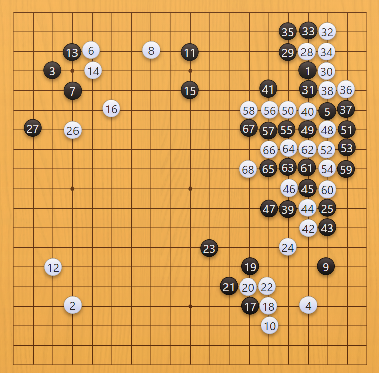
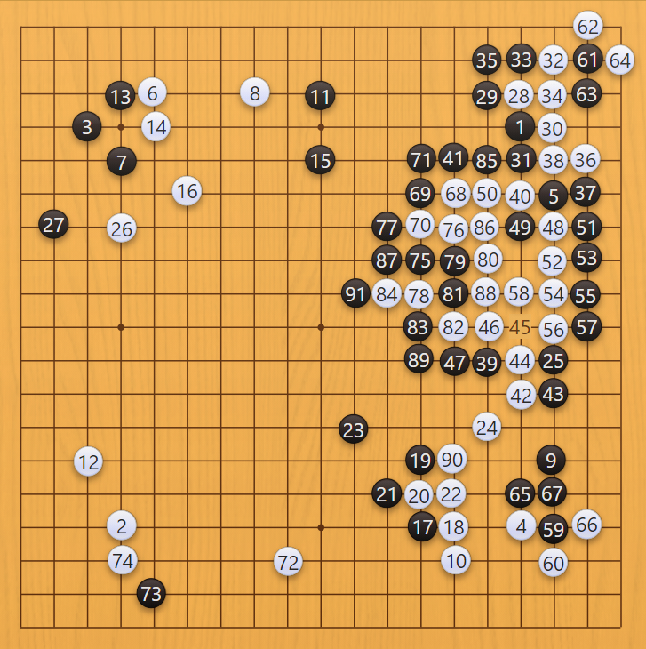

这盘棋是这段时间升到8段后的第一盘棋，而看了下对手的对局记录，则是刚才9段掉到8段。信息显示是乌克兰人。

开局星小目后小飞，对手挂角，秀策尖，白棋拆二。我在下方挂一手，为后续作战引征，再从上方积极逼住二子；白棋脱先守角，我便尖顶后跳起，对白棋施压的同时扩张右边阵势。白棋飞起出头。这里左边应该在边上拆一手，避免被白棋飞下彻底走厚走畅。

实战在右下尖冲跳起，白棋挖粘，我飞补。白棋飞出，我拆二。这个拆二似乎也不对，既然是我的阵势，就应该飞起，被对手压两手就拿住边空，下边4颗子很有弹性，对手的厚势潜力也是有限。实战拆二以后被对手尖冲，为空太低。但飞起也不太对，最开始就不应尖冲，要么大飞回来，要么左上拆一手。

实战被白26手飞下后感觉很为难，原本进攻白棋，却反被封锁，不愿让白棋走太厚，于是二路飞一手。但这样白棋彻底走畅，无法进攻。白棋28手保留左边变化，选择在右上托；我觉得外面走了一堆，总该注重外边。打算抢到先手，左下侵分感觉很大。右上定式不应这么下，不能打，要立下，这样可以抢先手。

实战对面38手想强抢先手，这个断我觉得不怕，遂跳起围模样。

对手直接断，我就跳补上面的断点。角上还是个紧带钩，忘了有没有强手了。

对手下面尖。这人很恶心啊。三路连回，味道很恶。对手直接冲完断上边，那没有怕的道理，直接长出，看他怎么应对。对手上下有诸多先手，还是很吓人

对手长考后搬下，很凶狠。我感觉只能断一下然后从二路爬回。58手对手提吃，黑棋潜力消弭殆尽，但白棋联络仍有缺陷。61、63在角上留下味道（但走的不三不四，要走就交换完形成万年劫）。白棋68、70走完后回到下面夹攻，很烦人，我侵分一手，白棋74强硬并住。

我75手一夹，个人认为是好棋，借白棋弱点加强下面的孤棋，始终瞄着分断白棋大龙。白棋沾完夹，我冲下后又不舍得上面5颗子，感觉对之前作战胜利有些昏头了。85打吃仍不弃子，黑棋一粘，威胁双打吃。

我原以为白棋会粘住，然后黑棋也粘住，白棋联络，黑棋再吃住中间二子，黑棋整个中间铁厚，应当挽回败势。

实战白棋直接弃掉上面7颗子，在下面靠出不肯被封锁，十分冷静（实际上AI觉得还是要粘住。但我觉得明显这样更有压迫感）！我97想扳住二子头，但害怕被切断，于是想在下面靠寻求补断。这是实际上差不多55开。但是对手非常强，后续几乎不出错。101、102交换完后，右下角之前侵分就损了进去。但我想中间连扳，对面长出就拔花。但这样落了后手，拔花虽厚，但白棋右上随后愉快先手交换补强，白棋全盘没有易攻之形，黑棋也没什么成空潜力。白棋118在下面继续抢空，非常的有压迫感。

121靠是劣势下发力。这时候其实盘面2、3目，差得不大（但以我野路子收官，也要输）。直到141手，左边成了十几目空。白棋左下沾一手感觉是很大的逆收。嗐，中盘末官子初就应该把所有逆收都走掉！

黑145点，147尖顶，本预料白棋148从上面扳，然后黑棋连回，拿住一些空。但白棋还是有高手经验，算清直接立下。黑棋147还是应该托！不过145点本来也不好，应当二路尖，左边还留着打拔。被白棋158先手顶，上面黑棋白忙一场，单官连回，白棋空围了空破了，回到右上补住，消除最后的不稳定因素（这里也看到之前如果交换完，白棋一手棋消不掉的好处）。如果黑棋145不点，而是到右上角打吃，还是白棋好半目的形式，很复杂。但到160这，这盘棋已经没希望了。随后坚持几手，就投子认负。

这盘我大部分棋还是深思熟虑的，只是很多时候缺乏经验和完整思考，没有平等地处理所有分支，一旦想一条路就产生惰性而不去思考别的可能。同时没有去仔细点目判断形式。说到底还是下棋的习惯不好。希望以这盘棋为戒，吸取教训，往后冷静拿下棋局！

